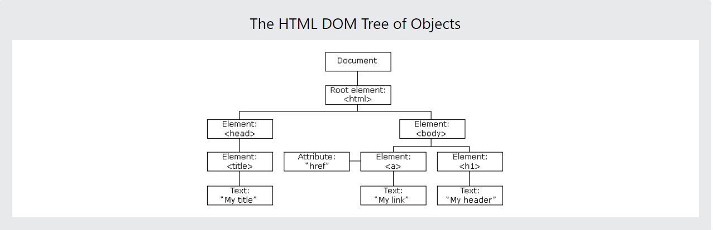

# DOM

* Using DOM JavaScript can access and change all the element of HTML Document.

# What is DOM?
* DOM Stand for Document object model.
* When web page is loaded, the browser create a DOM of the page.
* HTML DOM Model is constructed as Tree of the object. 
* DOM is used to do dynamic changes to the webpage using javascript.

* The HTML elements as objects
* The properties of all HTML elements
* The methods to access all HTML elements
* The events for all HTML elements

* The HTML DOM is a standard for how to get, change, add, or delete HTML elements.



# DOM Manipulation

* Manipulation is nothing but an accessing an element and changing the element or deleting.

* we have two types for manipulation.

1. Method -- is an action you can do like add, delete an html element.
2. Properties -- is a value that you can get or set (like changing the content of an HTML element)

# Accessing/Getting HTML Element

* we have some method to access the html element.

1. getElementById("id") --> This take id value inside the square brackets.
2. getElementsByClassName("className") -- This take class Name inside the square brackets.
3. getElementByTagName("TagName")--> This take HTML Tag Name inside the Square Brackets.
4. querySelector("id,className,TagName") -- This Method take ID or ClassName or TagName.
5. querySelector("TagName or ClassName") -- This Method takes TagName or ClassName.

# 1. getElementById():

* This method targets a single HTML element and return single element
* We pass the id without # as an argument.

```js
//syntax
document.getElementById('id')
```
```html
<!DOCTYPE html>
<html lang="en">

<head>
    <meta charset="UTF-8">
    <meta name="viewport" content="width=device-width, initial-scale=1.0">
    <title>DOM</title>
    <link rel="stylesheet" href="style.css">
</head>

<body>
    <h1 class='title' id='first-title'>First Title</h1>
    <h1 class='title' id='second-title'>Second Title</h1>
    <h1 class='title' id='third-title'>Third Title</h1>
    <h1></h1>
    <script src="./script.js"></script>
</body>

</html>

```

```js
let firstTitle = document.getElementById("first-title");
console.log(firstTitle); // This give us HTML element

console.dir(firstTitle); // This gives us Document 
```
# One More Example 
* The Below ID is not Present in the HTML element Output will be **null**

```js
let firstTitle = document.getElementById("first");
console.log(firstTitle); // This give us HTML element 

console.dir(firstTitle); // This gives us Document 
```

# 2. getElementsByClassName("ClassName").

* getElementsByClassName() method returns an HTMLCollection object
* An HTMLCollection is an array like list of HTML elements

```js
//syntax
document.getElementsByClassName('classname')
```

```js
let Access_ClassName = document.getElementsByClassName("title");

console.log(Access_ClassName); // output --> HTML Collection

console.log(Access_ClassName.length) // length - 3

```
* The length property provides the size of the collection

* It is possible to loop through all the HTMLCollection elements

```js
for (let val = 0; val < Access_ClassName.length; val++) {
    console.log(Access_ClassName[val]);
}
```
# One More Example:

* if you are accessing with class name which is not present in html dom element.

```js
let access_class_name_not_present = document.getElementsByClassName("class");

console.log(access_class_name_not_present); // output is Empty HTML Collection
```
*  Output wil be **Empty HTML Collection**

# 3. getElementByTagName():

* This Method take as tag name as string parameter and return in HTML Collection.
* An HTMLCollection is an array like object of HTML elements.
* This is used to if you want to select all the same tags in the html.
* The length property provides the size of the collection
* Whenever we use this method we access the individual elements using index or after loop through each individual items

```js
// syntax
document.getElementsByTagName('tagname')
```

```js
let allTags = document.getElementsByTagName("h1");
console.log(allTags) // HTML Collection
console.log(allTags.length) // 4

// for loop
for (let i = 0; i < allTags.length; i++) {
    console.log(allTags[i]);
}
```
# One More Example:

* if you are accessing with tag name which is not present in html dom element.

```js
let allTags_not_present = document.getElementsByTagName("h1");
console.log(allTags_not_present) // Empty HTML Collection

```

# 4. querySelector()

* Using querySelector we can access by className or id or TagName.
* This Method is used to get the first element from the html.

```js
let firstTitle1 = document.querySelector('h1') // select the first available h1 element
console.log(firstTitle1);
let firstTitle3 = document.querySelector('#first-title') // select id with first-title
console.log(firstTitle3);
let firstTitle4 = document.querySelector('.title') // select the first available element with class title
console.log(firstTitle4);
```
# One More Example:

* if you are accessing with tag name or className or id which is not present in html dom element. return **null value**

```js
let firstTitle5 = document.querySelector('.title123') // select the first available element with class title
console.log(firstTitle5); // null
```

# 5. querySelectorAll():

* Using querySelectorAll we can access by className or TagName.
* It returns a **nodeList** which is an array like object which supports array methods.
* We can use **for loop or forEach** to loop through each nodeList elements

```js
const allTitles = document.querySelectorAll('h1') // selects all the available h1 elements in the page
console.log(allTitles); // nodeList is created
console.log(allTitles.length); // 4

// for loop

for (let i = 0; i < allTitles.length; i++) {
    console.log(allTitles[i]);
}

//output

// h1#first-title.title
// h1#second-title.title
// h1#third-title.title
// h1
```
# One More Example:
* if you are accessing with class name or tag name which is not present in html dom element. return **empty NodeList[]**

```js
const allTitles1 = document.querySelectorAll('h3') // selects all the available h1 elements in the page
console.log(allTitles1); // nodeList is created
console.log(allTitles1.length); // 0

// for loop

for (let i = 0; i < allTitles1.length; i++) {
    console.log(allTitles1[i]);
}

//output

// NodeList[]
```

# Properties

* we have some main properties in DOM.

1. tagName
2. innerText
3. innerHTML
4. textContent


# 1. tagName -> return tag Name form the element node.

```js
let tagName = document.querySelector("h1");
let result = tagName.tagName;
console.log(result); // H1
```
# One More Example:
* if you are accessing with class name or tag name which is not present in html dom element. return **error**

```js
let tagName1 = document.querySelector("h3");
let result1 = tagName1.tagName;
console.log(result1); // H1
```


# 2. innerText --> return the text content of the element and all its children. return all the content from the html in **string**

```js
let text = document.querySelector("h1");
text.innerText = "hello world"
console.log(text);
```
# One More Example:

* if you are accessing with class name or tag name or id which is not present in html dom element. return **error**

```js
let text1 = document.querySelector("h3");
text1.innerText = "hello world"
console.log(text1);
```

# 3. innerHTML --> 

* We use innerHTML property when we like to replace or a completely new children content to a parent element.
* Create a new tag with innerHTML in the HTML
* innerHTML can add a text or HTML element or elements as a child.

```js
let innerHtml = document.querySelector('h1');
innerHtml.innerHTML = "<ul>Hello</ul>"
console.log(innerHtml)
```

# 4 . textContent --> textContent property is used to add text to an HTML element

```js
let content = document.querySelector('h1');
content.textContent = "Welcome";
console.log(content);
```

# Attributes In DOM:

# getAttribute():
* An attribute is used to add in the opening tag of HTML which gives additional information about the element.
* Common HTML attributes: id, class, src, style, href,disabled, title, alt

```js
const attr = document.querySelector('div');
let id = attr.getAttribute("id"); // id --> attribute name
console.log(id); // box --> id value 
```

# SetAttribute():
* setAttribute() method set any html attribute. It takes two parameters the type of the attribute and the name of the attribute

```js
// syntax
setAttribute('attrName', 'value');
```
* changing the class name from the existing

```js
const titles12 = document.querySelectorAll("h1");
titles12[3].setAttribute('class', "newclass-123");
```

* add new class name inside the tag.
```js
const titles1 = document.querySelectorAll("h1");
titles1[4].setAttribute('class', "newclass-123");
```

# style:

* add some styles to tags.

```js
const h12 = document.querySelector("h1");
h12.style.background = "yellow";
```

```js
const titles = document.querySelectorAll('h1')
titles.forEach((title, i) => {
    title.style.fontSize = '24px' // all titles will have 24px font size
    if (i % 2 === 0) {
        title.style.color = 'green'
    } else {
        title.style.color = 'red'
    }
})
```

# Adding class using classList

* class list method is a good method to append additional class
* It does not override the original class if a class exists rather it adds additional class for the element.

* this need old class name when you are adding the new class 

```js
let div = document.querySelector('div');
div.setAttribute('class', "navin-div");
div.classList.add("navin-div", "rapelli")

```

# Removing class using remove

* if you want to remove the class name 

```js
div.classList.remove("navin-div")
```

# Exercise:
1. Create an index.html file and put four p elements as above: Get the first paragraph by using document.querySelector(tagname) and tag name

2. Get each of the the paragraph using document.querySelector('#id') and by their id

3. Get all the p as nodeList using document.querySelectorAll(tagname) and by their tag name

```js
    let par = document.querySelectorAll('p');
    console.log(par);
    let tagName = par.tagName;
    console.log(tagName)
```

4. Loop through the nodeList and get the text content of each paragraph
```js
 for (let i = 0; i < par.length; i++) {
      console.log(par[i]);
 }
```
5. Set a text content to paragraph the fourth paragraph,Fourth Paragraph

```js
    let par = document.querySelectorAll('p');
    par[3].textContent = "Fourth Paragraph";

```

6. Set id and class attribute for all the paragraphs using different attribute setting methods

```js
    let par = document.querySelectorAll('p');
    let idx = 1;
    for (let i = 0; i < par.length; i++) {
        par[i].setAttribute('class', 'new class');
        par[i].setAttribute('id', `id-para ${idx}`)
        idx++;
        console.log(par[i]);
        }
```

